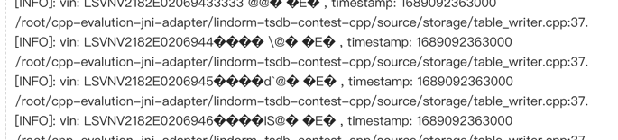

# 表数据结构
+ 参见官方赛题说明
  

# TSDBEngine 构造函数
+ 传入 dataPath，创建数据库对象
+ dataPath 为数据库存储数据的本地目录
+ 选手不可以使用 dataPath 以外的目录进行数据存储，否则成绩无效
+ dataPath 目录如果不存在程序会终止，选手测试时需要注意这一点，正式评测时保证目录存在且为空
+ TSDBEngineImpl 选手实现时，构造函数签名不能修改，因为评测程序会使用该构造函数来创建 TSDBEngineImpl 对象，但该构造函数的具体实现可以修改
  

# connect 接口
+ 加载数据库对象，如果 dataPath 内已有数据，则加载，否则创建新数据库
+ 评测程序可能会重启进程，使用相同 dataPath 加载数据库对象，并检查先前写入数据，因此选手必须实现可持久化能力
  

# createTable 接口
+ 创建一个表
+ 参数为表名以及 Schema 信息
+ 注：初赛中，只会创建一张表
  

# shutdown 接口
+ 关闭已连接的数据库（和 connect 接口组合调用）
+ 当本接口返回时，要求所有数据已落盘持久化
  

# upsert 接口
+ 写入若干行数据到某一表中
+ 传入表名，行（Row）对象，其中每个 Row 对象必须包含全部列，不允许空列（评测程序会保证这一点），注意长度为 0 的字符串不属于空列
+ 接口成功返回后，要求写入的数据立即可读
+ 本接口必须支持并发调用（Multi-thread friendly）
+ 如果数据库中已存在某行（vin + timestamp 组合已存在），覆盖先前的行
+ 入参 wReq 为临时对象，选手不可以直接缓存改对象数据的指针，因为 upsert 函数返回后该对象会被清理
  

# executeLatestQuery 接口
+ 获取若干 vin 的最新行（该 vin 的所有行中，timestamp 最大的一行）的某些列
+ requestedFields 参数标记了需要获取的列的名称，未在该参数中标记的列不能返回
+ requestedFields 如果为空，代表请求所有列
+ 如果某个 vin 在数据库中不存在，则跳过该 vin
+ 本接口必须支持并发调用（Multi-thread friendly）
+ 初赛不考察返回结果 vector 中元素的顺序，只要所有结果都包含在 vector 中即可

> 查询的方法：
> 1. 将给定的vin按照字典序将末位字符+1，得到(vin+1)，然后timestamp视为0，最终合成的key为 (vin+1)0
> 2. 例如：假设vin为 xxx，末位+1得到xxy，timestamp补0，得到合成的key为xxy0
> 3. 然后利用lower bound算法查找第一个大于等于合成key的位置，记为pos，那么pos-1位置的值就是我们需要查找的
  

# executeTimeRangeQuery 接口
+ 获取某一个 vin 若干列
+ 获取的列的 timestamp 应该位于 timeLowerBound 和 timeUpperBound 之间，不包括 timeUpperBound，包括 timeLowerBound
+ timeLowerBound < timeUpperBound
+ requestedFields 参数标记了需要获取的列的名称，未在该参数中标记的列不能返回
+ 如果 vin 在数据库中不存在，返回空集合
+ 本接口必须支持并发调用（Multi-thread friendly）
+ 初赛不考察返回结果 vector 中元素的顺序，只要所有结果都包含在 vector 中即可

> 查询的方法
> 1. 将vin和timeLowerBound以及timeUpperBound拼接成为key1和key2，因此本查询得到的结果为[key1, key2)区间中的值
> 2. 首先利用lower bound算法查找第一个大于等于key1的位置，记为pos1
> 3. 然后再次利用lower bound算法查找第一个大于等于key2的位置，记为pos2
> 4. 最终time range结果的范围为[pos1, pos2-1]

# 写入的步骤：

1. 评测程序是以每次insert500行数据为单位进行插入操作的
2. 一批待插入的数据首先在TableWriter中"行转列"，得到block，然后将一次性append到memtable中，append的过程也会数据排序的操作
3. 我们定一个参数为MEM_TABLE_FLUSH_THRESHOLD，这个参数规定了当memtable中存有多少行数据（或者记录数据量大小，比如16M）之后会flush到SegmentWriter中，生成一个segment文件，这个过程中会隐式的给每行数据编号，也就是赋予每行数据行号（ordinal）的概念
4. 我们再定一个参数为NUM_ROWS_PER_GROUP，这个参数代表SegmentWriter接收到这一批有序数据之后，按照每NUM_ROWS_PER_GROUP行数据为一个group生成short key 索引，取每个group的第一行数据的key列（vin+timestamp）作为short key构成索引项，也就是说，最终short key索引的每一项为"short key与当前short key所在group的第一行数据的行号"之间的映射。
5. SegmentWriter维护好short key索引之后，会将数据以列为单位append到每一列的ColumnWriter（有多少列就有多少个ColumnWriter）
6. 我们再定义一个参数为XXX_PAGE_SIZE（XXX代表不同的编码策略），ColumnWriter在接收到一列数据之后会利用PageEncoder写入到每一个DataPage中，最终数据是以DataPage为单位flush到磁盘上的。可以通过实例化不同的PageEncoder来实现不同的数据编码方式（不同的数据类型使用不同的编码方式）
7. 每个ColumnWriter会维护好当前列的ordinal index索引数据，ordinal index索引的每一项存储的是"每个DataPage首行数据的行号（也就是ordinal）与该DataPage的PagePointer（offset+size）"之间的映射关系，通过ordinal index索引，当给定需要查找的行号时，我们能够很快地定位到我们所需要查找的DataPage
8. 最终将每个DataPage落盘并记录meta信息之后就生成了这一批数据的Segment文件

## 该结构的优点：
1. 数据以Segment为单位局部有序，能够通过Short Key 索引二分查找快速定位到所需数据行号（ordinal），然后通过行号利用ordinal index索引能够快速定位到当前行号对应数据所在的DataPage，通过索引能够显著减少磁盘的IO
2. 数据完全以列存的形式存储，查询时只需要读取所需的列，不必将全部列读入内存，大大减少磁盘的IO。除此之外，每列的数据类型相同，便于数据编码和数据压缩
3. 该存储引擎采用了LSM Tree的原理，具有较高的写效率，适合处理时序数据这样大批量导入的场景

## 该结构的缺点：
1. 由于LSM Tree对读操作不太友好，因此数据查询的过程中需要读取memtable以及多个segment文件，具有读放大的缺陷
2. 对数据的去重不太友好，memtable能够做到一批数据内的去重，但全局数据的去重需要在读取完每个segment文件之后采用归并算法来去重
3. 对于小批量数据的写入不太友好，但我们采用增量插入的策略，先将数据插入到memtable中，等数据量到达一定规模后一同落盘

# 查询的步骤

1. 已知当前时刻数据库中数据除了存在磁盘的多个segment文件之外，还有一部分数据是存在内存的memtable中的
2. 当给定查询条件后，查询模块需要同时读取内存memtable中的数据以及磁盘的多个segment文件，然后使用归并算法排序和去重
3. 由于memtable以及多个segment文件中的数据都是局部有序的，因此可以同时利用lower bound算法在多个数据片段上得到结果，最终将每个局部结果归并汇总即可得到最终的全局结果
4. 以key=xxx666为例（方便演示，vin和timestamp均取三位数），展示查询模块的工作流程：
a. 首先在内存中的memtable进行查询，由于memtable采用的是SkipList的结构，数据本身就是有序的，因此采用lower bound算法能够以logn的时间复杂度查询到所需结果
b. 然后多线程并行查询每一个Segment文件，首先读取segment文件的footer，得到short key索引的IndexPage，将IndexPage读到内存中用short index reader 解析每一条数据项
c. 通过比对short key，得到一个行号（ordinal）的区间。例如short key index为 [aaa000:0], [vvv000:1024], [yyy000:2048], [zzz000:3072]，由于xxx666 > vvv000且xxx666 < yyy000，因此xxx666落在1024~2048这个区间内
d. 细节：Because previous block may contain this key, so we should set rowid to last block's first row. 比如某一个ordinal index项为xxx666，但它之间的几条数据也都是xxx666，碰巧查询条件为xxx666，那么需要包含当前group的前一个group的数据
e. 因此最终得到的ordinal range为[0, 2048)
f. 然后通过二分查找得到key精确的ordinal位置
g. 按照上述两个接口查询的规则，上述步骤重复一到两次就能得到所需数据的ordinal的精确范围
h. 借助ordinal index并结合ordinal的精确范围，可以很快的定位到所需数据所在的DataPage，从磁盘中解析并读入内存，读取所需ordinal范围的数据输出作为局部结果
5. 多个Segment文件得到的局部结果在TableReader模块进行汇总，然后利用归并算法进行去重后，就可以输出结果了

